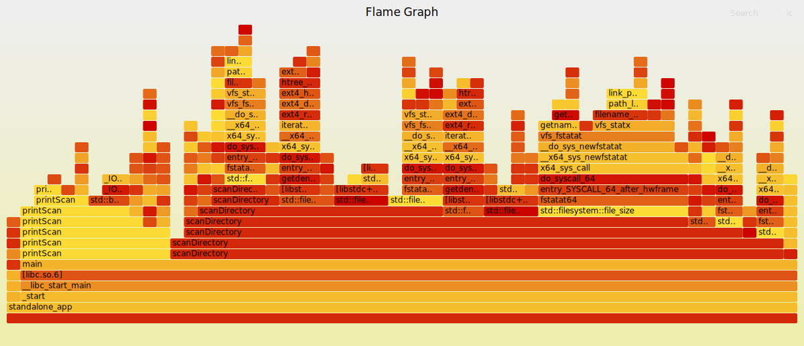

# GenFlames: Auto C++ Flamegraph Generator

This repository automatically profiles your C++ code and generates interactive flamegraphs and performance summaries whenever you push changes.

### 🚀 How it Works
1. **Push your code**: Put your `.cpp` files or a CMake-based project in this repository.
2. **Auto-Profile**: GitHub Actions runs your code under `perf` on a Linux runner.
3. **Analyze**: An interactive flamegraph (`flamegraph.svg`) and a performance summary are generated and updated in this README automatically.

### Performance Summary

#### 📊 Execution Statistics (perf stat)
<!-- START_PERF_STAT -->
```text
# started on Wed Apr 15 20:01:29 2026


 Performance counter stats for './standalone_app /usr/include':

         122720931      task-clock                       #    0.545 CPUs utilized             
               601      context-switches                 #    4.897 K/sec                     
                 3      cpu-migrations                   #   24.446 /sec                      
              1738      page-faults                      #   14.162 K/sec                     
   <not supported>      cycles                                                                

       0.225240845 seconds time elapsed

       0.026045000 seconds user
       0.098973000 seconds sys


```
<!-- END_PERF_STAT -->

#### ⏱️ Latency Percentiles
<!-- START_PERF_LATENCY -->
```text
Average: 0.025s
P90:     0.05s
P95:     0.05s
P99:     0.05s
```
<!-- END_PERF_LATENCY -->

#### 🔍 Top Functions (perf report)
<!-- START_PERF_SUMMARY -->
```text
# Overhead       Samples  Command         Shared Object        Symbol                                                                                                                                                                            
# ........  ............  ..............  ...................  ..................................................................................................................................................................................
#
     5.17%             3  standalone_app  [kernel.kallsyms]    [k] __d_lookup_rcu
            |
            ---__d_lookup_rcu
               lookup_fast
               walk_component
               |          
               |--3.45%--link_path_walk
               |          |          
               |          |--1.72%--path_openat
               |          |          do_filp_open
               |          |          do_sys_openat2
               |          |          __x64_sys_openat
               |          |          x64_sys_call
```
<!-- END_PERF_SUMMARY -->

### Live Performance Profile
Click the image to open the interactive SVG and zoom into specific function stacks.

<p align="center">
  <a href="./flamegraph.svg">
    
  </a>
</p>

---
*Generated by [GenFlames](https://github.com/abhyuday-fr/GenFlames)*
